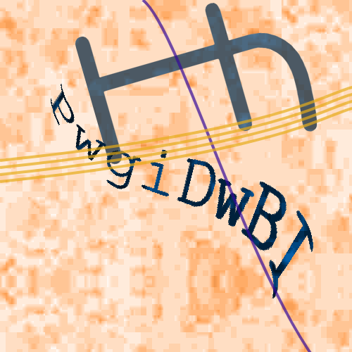
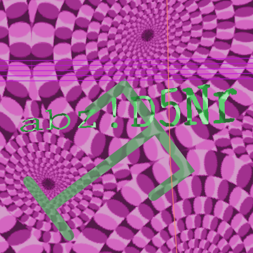

# Captchalogue Code Generator

A generator for [captchalogue](https://mspaintadventures.fandom.com/wiki/Sylladex) card backs. This aims to be as accurate as possible to the source material, while still being random. 

## Examples





## Running
```sh
npm i
npm run build && npm run serve
```